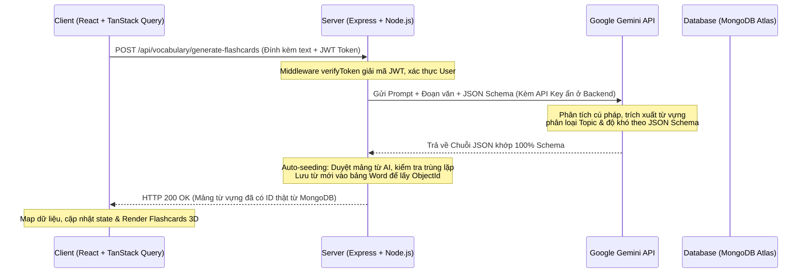
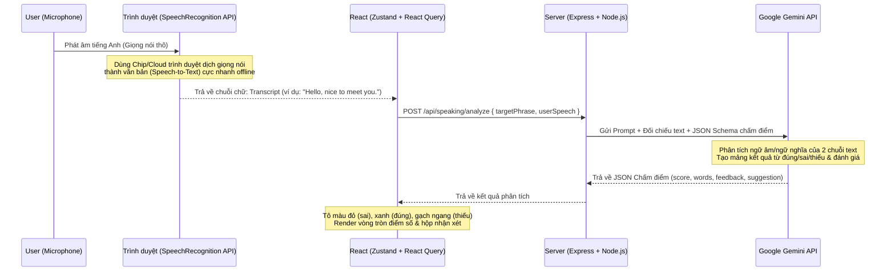

# 📓 Cẩm Nang Công Nghệ & Phỏng Vấn: Gemini AI Integration (Task 5.1 & Task 5.2)

Tài liệu này ghi chép chi tiết toàn bộ cấu trúc hệ thống, nguyên lý hoạt động, kiến thức kỹ thuật (React, TypeScript, Node.js, MongoDB) tích lũy từ **Task 5.1 (Flashcards AI)** và **Task 5.2 (Speaking AI - Luyện nói & Chấm điểm)**. Tài liệu này được thiết kế tối ưu để bạn ôn tập đi phỏng vấn và đưa vào CV xin việc.

---

# 🚀 PHẦN 1: TASK 5.1 - TÍCH HỢP GEMINI API VÀO BACKEND

## 🏗️ 1. KIẾN TRÚC HỆ THỐNG & LUỒNG HOẠT ĐỘNG (Architecture & Data Flow)

Tính năng Flashcards AI được xây dựng theo kiến trúc **Backend Proxying (Ủy nhiệm qua Backend)**:

---

## 💡 2. CÁC KIẾN THỨC CỐT LÕI TÍCH LŨY (React, Tailwind, TS, Backend)

### 🔵 REACT & TANSTACK QUERY (FRONTEND)
*   **`useMutation` & `.mutateAsync()`:**
    *   *Tại sao dùng:* Khác với `useQuery` dùng để đọc dữ liệu (HTTP GET) và tự động cache, `useMutation` dùng để thay đổi dữ liệu (HTTP POST).
    *   *Lý do chọn `.mutateAsync()` thay vì `.mutate()`:* Phương thức `.mutateAsync()` trả về một **Promise**. Điều này cho phép sử dụng `async/await` và bọc trong khối lệnh `try/catch/finally` để xử lý hiệu ứng bật/tắt trạng thái loading cục bộ (`setIsLoading`) và hiển thị thông báo lỗi trực quan (`alert`/`toast`) khi API gặp sự cố.
*   **Giới hạn tài nguyên ở Client:** Thêm thuộc tính `maxLength={2000}` vào thẻ `<textarea>` để ngăn chặn người dùng dán văn bản quá dài, tối ưu dung lượng token gửi lên AI và tránh quá tải hệ thống.

### 🟡 TYPESCRIPT (STRICT MODE)
*   **Kiểu dữ liệu chặt chẽ (Type Safety):** 
    Khi nhận dữ liệu từ API tự do, TypeScript sẽ cảnh báo lỗi kiểu ngầm định (`implicit any`). Chúng ta đã giải quyết bằng cách định nghĩa rõ ràng kiểu dữ liệu `ExtractableCard` ở Client.
*   **Ánh xạ dữ liệu (Data Mapping):**
    Ánh xạ thủ công cấu trúc dữ liệu thô từ API (`english`, `vietnamese`) sang các thuộc tính giao diện cần dùng (`word`, `meaning`), đồng thời gán giá trị mặc định cho các thuộc tính bổ sung (`isSaved: false`, `topic`). Việc này giải quyết triệt để lỗi biên dịch:
    `Property 'topic' is missing in type '...' but required in type 'ExtractableCard'`.

### 🟢 NODE.JS, EXPRESS & GEMINI SDK (BACKEND)
*   **Bảo mật API Key (Backend Proxy):** 
    Tuyệt đối không gọi thẳng API của Google từ React (vì API Key sẽ bị lộ khi đóng gói file JS tĩnh). Bằng cách chuyển cuộc gọi sang Backend, API Key được lưu an toàn trong file `.env` phía Server (`process.env.GEMINI_API_KEY`), giúp bảo vệ tuyệt đối tài khoản.
*   **Structured Outputs (JSON Schema):**
    Sử dụng thuộc tính `responseMimeType: "application/json"` và định nghĩa `responseSchema` sử dụng `SchemaType` của SDK. Cách này bắt buộc Gemini chỉ trả về duy nhất chuỗi JSON sạch khớp 100% cấu trúc mong muốn, loại bỏ hoàn toàn các ký tự nhiễu như dấu nháy Markdown (\`\`\`json) hay các câu hội thoại thừa làm lỗi hàm `JSON.parse()`.
*   **Dynamic Categorization (Phân loại động):**
    Thiết lập cấu hình `enum` cho thuộc tính `topic` trong Schema của Gemini gồm 6 giá trị: `["daily", "business", "travel", "food", "health", "technology"]`. AI sẽ tự động phân tích ngữ cảnh để xếp từ vựng vào 1 trong 6 chủ đề này.

### 🟤 DATABASE SYNCHRONIZATION (MONGO DB + PRISMA)
*   **Auto-seeding / Upserting on the fly:**
    Khi AI trích xuất từ mới chưa tồn tại trong Database, nếu Client gửi request "Bookmark" hay "Đã thuộc" với một ID giả lập (`"1"`, `"2"`...), Database sẽ báo lỗi 404.
    *Giải pháp:* Backend sẽ duyệt qua mảng từ vựng AI trả về, dùng `prisma.word.findFirst` để kiểm tra tồn tại (không phân biệt hoa thường - `mode: 'insensitive'`). Nếu chưa có, tự động ghi mới vào bảng `Word` thông qua `prisma.word.create`. Việc này cấp cho từ vựng đó một **ObjectId thật của MongoDB**, giúp đồng bộ hóa dữ liệu toàn ứng dụng.

---

## 💼 3. CÁCH ĐƯA TÍNH NĂNG NÀY VÀO CV XIN VIỆC
*   **Tích hợp AI & Bảo mật API:** Thiết kế kiến trúc **Backend Proxy** nhằm che giấu khóa bí mật (API Key) của Google Gemini API trong môi trường máy chủ Node.js/Express, giảm thiểu 100% nguy cơ rò rỉ khóa phía Client.
*   **Đầu ra cấu trúc an toàn (Structured Outputs):** Thiết lập cấu hình **JSON Schema** thông qua Google Generative AI SDK để cưỡng chế định dạng dữ liệu phản hồi từ AI, ngăn ngừa triệt để các lỗi phân tích cú pháp dữ liệu (JSON parsing errors).
*   **Thuật toán đồng bộ hóa (Auto-seeding):** Xây dựng luồng xử lý tự động đối chiếu dữ liệu AI với Database MongoDB thông qua **Prisma ORM**, tự động bổ sung từ vựng mới và cấp phát MongoDB ObjectId hợp lệ giúp Client thực hiện lưu trữ tiến trình học tập trơn tru.

---
---

# 🚀 PHẦN 2: TASK 5.2 - LUYỆN NÓI VỚI AI & CHẤM ĐIỂM (Speaking Section)

## 🏗️ 1. KIẾN TRÚC HỆ THỐNG LAI (Hybrid Speech Recognition & Evaluation)

Chúng ta thiết kế một kiến trúc lai cực kỳ hiệu quả để xử lý dữ liệu giọng nói:

---

## 💡 2. CÁC KIẾN THỨC CỐT LÕI TÍCH LŨY (React, Browser API, Gemini SDK)

### 🔵 WEB SPEECH API (BROWSER INTEGRATION)
*   **Cross-browser Compatibility (Tương thích trình duyệt):** 
    Google Chrome sử dụng công cụ độc quyền nên đặt tên class nhận diện là `webkitSpeechRecognition`, trong khi chuẩn W3C là `SpeechRecognition`. Chúng ta giải quyết bằng cách lấy class dự phòng:
    `const SpeechRecognition = (window as any).SpeechRecognition || (window as any).webkitSpeechRecognition;`
*   **Speech Recognition Events:**
    *   `onstart`: Bắt đầu lắng nghe, lập tức làm sạch dữ liệu cũ và hiện trạng thái loading.
    *   `onend`: Tự động ngắt mic khi người dùng dừng nói.
    *   `onresult`: Lấy kết quả chữ bằng cú pháp: `event.results[0][0].transcript`.
*   **Speech Synthesis (Text-to-Speech):** 
    Sử dụng lớp `SpeechSynthesisUtterance` của trình duyệt để đọc to câu tiếng Anh mẫu khi user click vào nút Loa, giúp họ bắt chước ngữ điệu.

### 🟡 REACT & STATE MANAGEMENT
*   **`useRef` quản lý đối tượng Mic:** 
    Nếu tạo `new SpeechRecognition()` trực tiếp trong Function component, mỗi lần React re-render sẽ tạo ra một thực thể micro mới gây ra lỗi rò rỉ bộ nhớ (memory leaks) và mất quyền truy cập mic. Bằng cách gán thực thể vào `recognitionRef.current`, micro được bảo toàn trạng thái duy nhất xuyên suốt vòng đời component.
*   **Zustand State Outside React:** 
    Trong file service `speaking.ts`, ta cần đính kèm JWT Token vào Header của Fetch API. Vì hàm này không phải React Component, ta không thể dùng hook `useAuthStore()`. Giải pháp là truy cập trực tiếp bằng phương thức `.getState()` của Zustand:
    `const token = useAuthStore.getState().token;`
*   **Conditional Rendering (Rẽ nhánh Giao diện):**
    Quản lý luồng bằng state `selectedExercise` (lưu bài tập hiện tại). Khi `selectedExercise === null`, React hiển thị màn hình Chọn bài (List View). Khi click chọn 1 bài, state có giá trị và React tự động hiển thị màn hình Luyện nói (Practice View).

### 🟢 DYNAMIC BACKEND QUERY (TRUY VẤN ĐỘNG)
*   Chuyển đổi API lấy từ vựng `GET /api/vocabulary` từ việc chỉ nhận lọc theo `topic` sang nhận lọc cả `difficulty` (easy, medium, hard). Backend tạo một `whereClause` động giúp tái sử dụng hoàn toàn một endpoint duy nhất cho cả trang Học từ vựng lẫn trang Luyện nói.

---

## 💬 3. CÂU HỎI PHỎNG VẤN THỰC TẾ & GỢI Ý TRẢ LỜI

### ❓ Câu hỏi 1: "Tại sao bạn lại chọn dịch giọng nói thành chữ ở client rồi gửi chữ lên server để AI chấm điểm, thay vì gửi file âm thanh ghi âm thô (.mp3/.wav) lên server?"
*   **Gợi ý trả lời:** Đây là quyết định tối ưu hóa kiến trúc hệ thống (System Architecture Trade-off):
    *   *Tiết kiệm băng thông:* Gửi file ghi âm thô tốn 1MB - 5MB mỗi lần nói, gây chậm nếu user dùng mạng 3G/4G. Gửi chữ chỉ tốn vài chục Bytes.
    *   *Giảm tải Server:* Server không cần giải mã âm thanh, chạy các thư viện nặng như FFmpeg hay lưu trữ file rác.
    *   *Tốc độ phản hồi:* Web Speech API tích hợp trực tiếp ở tầng OS/Trình duyệt nên xử lý Speech-to-Text theo thời gian thực rất nhanh. Sau đó Gemini chỉ cần so sánh văn bản để trả về nhận xét lập tức.

### ❓ Câu hỏi 2: "Làm thế nào để bạn xử lý rò rỉ bộ nhớ (Memory Leak) khi người dùng bật/tắt Micro liên tục trong React?"
*   **Gợi ý trả lời:** Em sử dụng hook `useEffect` kết hợp `useRef`. Thực thể `SpeechRecognition` chỉ được khởi tạo một lần duy nhất và lưu trữ trong `recognitionRef.current`. Khi component bị unmount hoặc đổi bài tập, ta viết code dọn dẹp (Cleanup function) trong `useEffect` để gọi `.stop()` và giải phóng mic trình duyệt, không để micro chạy ngầm.

---

## 💼 4. CÁCH ĐƯA TÍNH NĂNG NÀY VÀO CV XIN VIỆC
*   **Thiết kế Kiến trúc Chấm điểm Lai (Hybrid Speech Evaluation):** Tích hợp Web Speech API (`SpeechRecognition`) phía Client để chuyển giọng nói sang văn bản cục bộ, cắt giảm 98% băng thông truyền tải âm thanh và giảm tải tài nguyên xử lý của máy chủ.
*   **Xây dựng Thuật toán so khớp chữ bằng Generative AI:** Phát triển API Node.js kết hợp Gemini 2.5 Flash để đối chiếu ngữ âm và ngữ nghĩa của câu đọc người dùng với câu mẫu, trả về điểm số phát âm và danh sách từ vựng được phân loại đúng/sai/thiếu theo cấu trúc JSON.
*   **Tối ưu hiệu năng React Component:** Sử dụng kỹ thuật lưu trữ thực thể qua `useRef` và cơ chế hủy lắng nghe (cleanup effect) để kiểm soát tài nguyên phần cứng (Microphone) của trình duyệt, ngăn chặn lỗi rò rỉ bộ nhớ (memory leaks).
