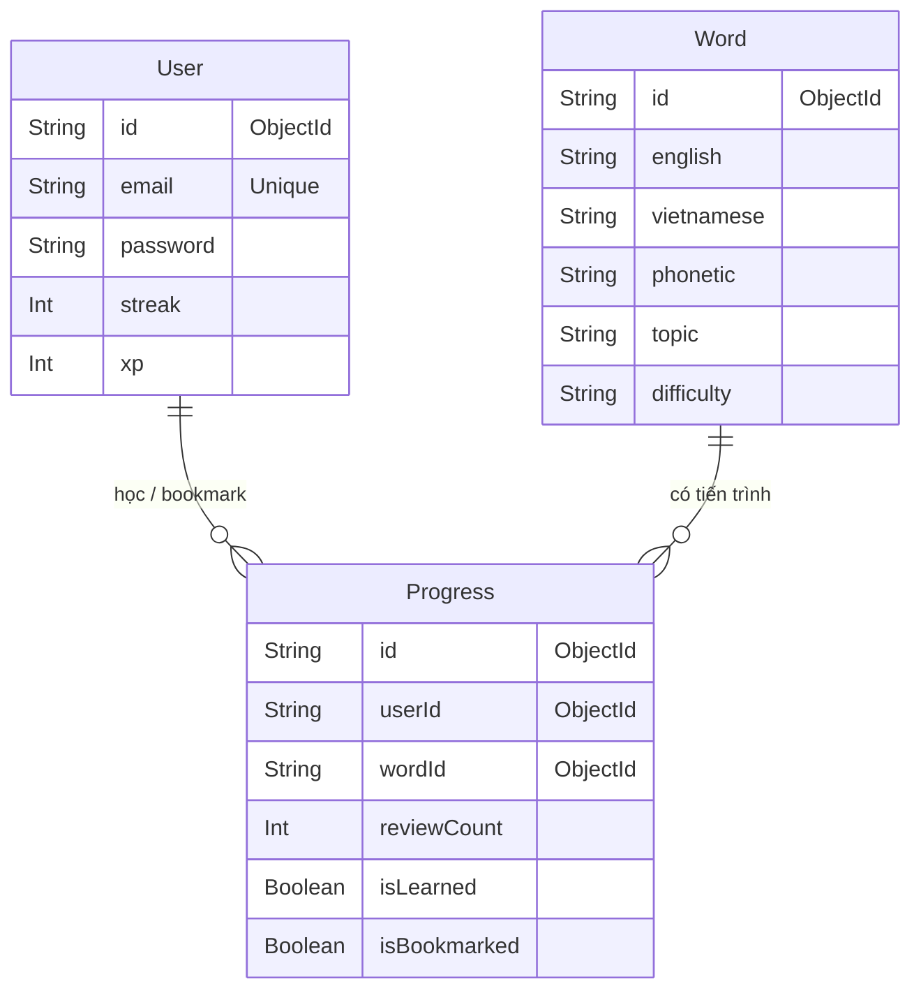

# MongoDB & Prisma: Cẩm Nang Toàn Diện và Tài Liệu Ôn Tập

Tài liệu này được biên soạn riêng cho dự án **Study English Platform** nhằm giúp bạn nắm vững kiến thức từ cơ bản đến nâng cao về MongoDB, cách thức hoạt động của cơ sở dữ liệu này dưới sự hỗ trợ của Prisma ORM, và các câu lệnh thực tế để ôn tập.

---

## 🗺️ Bản đồ nội dung
1. [Tổng quan về MongoDB (NoSQL Document Database)](#1-tổng-quan-về-mongodb)
2. [MongoDB trong dự án Study English](#2-mongodb-trong-dự-án-study-english)
3. [Ôn tập các lệnh CRUD: MongoDB Shell vs Prisma Client](#3-ôn-tập-các-lệnh-crud)
4. [Mối quan hệ (Relations) & Chỉ mục (Indexes)](#4-mối-quan-hệ-và-chỉ-mục)
5. [Các lỗi thường gặp và cách xử lý](#5-các-lỗi-thường-gặp-và-cách-xử-lý)

---

## 1. Tổng quan về MongoDB

MongoDB là hệ quản trị cơ sở dữ liệu **NoSQL** hướng tài liệu (Document-oriented) phổ biến nhất hiện nay. Thay vì lưu dữ liệu dưới dạng dòng và cột như SQL (MySQL, PostgreSQL), MongoDB lưu dữ liệu dưới dạng **BSON** (Binary JSON).

### 🔄 Bảng so sánh thuật ngữ SQL và MongoDB:

| Thuật ngữ SQL | Thuật ngữ MongoDB | Giải thích |
| :--- | :--- | :--- |
| **Database** (Cơ sở dữ liệu) | **Database** | Nơi chứa các bảng / tập hợp dữ liệu. |
| **Table** (Bảng) | **Collection** (Bộ sưu tập) | Tập hợp các tài liệu có cấu trúc tương tự nhau. |
| **Row** (Dòng / Bản ghi) | **Document** (Tài liệu) | Một bản ghi dữ liệu cụ thể (lưu dưới dạng BSON). |
| **Column** (Cột) | **Field** (Trường dữ liệu) | Cặp Key-Value trong một Document. |
| **Primary Key** (Khóa chính) | **_id (ObjectId)** | Khóa chính tự động sinh ra có độ dài 12-byte. |
| **Table Join** (Liên kết bảng) | **`$lookup` / Reference** | Cách liên kết dữ liệu giữa các Collection. |

### 💎 Đặc trưng cốt lõi của MongoDB:
- **Schema-less (Cấu trúc linh hoạt):** Các document trong cùng một collection không bắt buộc phải có các trường giống hệt nhau.
- **Dễ dàng mở rộng (Scalability):** Hỗ trợ mở rộng theo chiều ngang thông qua cơ chế *Sharding* (phân tán dữ liệu trên nhiều server).
- **Embedded Documents:** Cho phép lồng một Document con vào trong một Document cha, giúp giảm thiểu việc cần thiết phải Join nhiều bảng để lấy dữ liệu liên quan.

---

## 2. MongoDB trong dự án Study English

Trong dự án của bạn, MongoDB kết hợp với **Prisma ORM** để định nghĩa cấu trúc dữ liệu trong tệp `schema.prisma`.

### 📂 Phân tích Mô hình dữ liệu trong dự án:



### 📝 Chi tiết về kiểu dữ liệu đặc thù của MongoDB trong Prisma:
Trong Prisma, MongoDB yêu cầu các khóa chính phải khớp định dạng `ObjectId`:
```prisma
model User {
  id   String @id @default(auto()) @map("_id") @db.ObjectId
  // ...
}
```
- `@id`: Khai báo trường này là Khóa chính (Primary Key).
- `@default(auto())`: MongoDB sẽ tự sinh giá trị cho trường này khi tạo mới.
- `@map("_id")`: Ánh xạ trường `id` trong code thành trường `_id` thực tế trong MongoDB.
- `@db.ObjectId`: Chỉ định kiểu dữ liệu vật lý trên MongoDB phải là kiểu `ObjectId` (chuỗi hex 24 ký tự) chứ không phải chuỗi String thông thường.

---

## 3. Ôn tập các lệnh CRUD: MongoDB Shell vs Prisma Client

Dưới đây là bảng so sánh cú pháp truy vấn trực tiếp bằng **MongoDB Shell (Mongosh)** và cú pháp viết bằng **Prisma Client (Node.js)** dựa trên database của dự án.

### ➕ Create (Thêm mới dữ liệu)

* **Mongosh (MongoDB Shell):**
  ```javascript
  db.Word.insertOne({
    english: "Splendid",
    vietnamese: "Tuyệt vời",
    phonetic: "/ˈsplendɪd/",
    topic: "adjectives",
    difficulty: "medium"
  });
  ```
* **Prisma Client:**
  ```typescript
  await prisma.word.create({
    data: {
      english: "Splendid",
      vietnamese: "Tuyệt vời",
      phonetic: "/ˈsplendɪd/",
      topic: "adjectives",
      difficulty: "medium"
    }
  });
  ```

---

### 🔍 Read (Truy vấn dữ liệu)

#### 1. Lấy tất cả từ vựng thuộc chủ đề "adjectives":
* **Mongosh:**
  ```javascript
  db.Word.find({ topic: "adjectives" });
  ```
* **Prisma Client:**
  ```typescript
  await prisma.word.findMany({
    where: { topic: "adjectives" }
  });
  ```

#### 2. Lấy 1 từ duy nhất theo ID:
* **Mongosh:**
  ```javascript
  db.Word.findOne({ _id: ObjectId("60d5ec49f1b2c82b58cf0931") });
  ```
* **Prisma Client:**
  ```typescript
  await prisma.word.findUnique({
    where: { id: "60d5ec49f1b2c82b58cf0931" }
  });
  ```

---

### 📝 Update (Cập nhật dữ liệu)

#### 1. Tăng điểm XP của User thêm 10 điểm:
* **Mongosh:**
  ```javascript
  db.User.updateOne(
    { _id: ObjectId("60d5ec49f1b2c82b58cf0929") },
    { $inc: { xp: 10 } }
  );
  ```
* **Prisma Client:**
  ```typescript
  await prisma.user.update({
    where: { id: "60d5ec49f1b2c82b58cf0929" },
    data: { xp: { increment: 10 } }
  });
  ```

#### 2. Cập nhật hoặc tạo mới (Upsert) trạng thái học của từ vựng:
* **Prisma Client:**
  ```typescript
  await prisma.progress.upsert({
    where: {
      userId_wordId: {
        userId: "userId_example",
        wordId: "wordId_example"
      }
    },
    create: {
      userId: "userId_example",
      wordId: "wordId_example",
      isLearned: true
    },
    update: {
      isLearned: true
    }
  });
  ```

---

### ❌ Delete (Xóa dữ liệu)

* **Mongosh:**
  ```javascript
  db.Progress.deleteMany({ userId: ObjectId("60d5ec49f1b2c82b58cf0929") });
  ```
* **Prisma Client:**
  ```typescript
  await prisma.progress.deleteMany({
    where: { userId: "60d5ec49f1b2c82b58cf0929" }
  });
  ```

---

## 4. Mối quan hệ (Relations) & Chỉ mục (Indexes)

### 🔗 Mối quan hệ Nhiều-Nhiều (Many-to-Many) qua bảng trung gian
Trong SQL truyền thống, quan hệ nhiều-nhiều bắt buộc phải có một bảng trung gian kết nối. Với MongoDB, mặc dù ta có thể lưu mảng `wordIds` trực tiếp trong `User` (gọi là *Embedded references*), nhưng sử dụng một model trung gian (`Progress`) như dự án của bạn có các ưu điểm lớn:
1. **Lưu trữ siêu dữ liệu (Metadata):** Có thể lưu thêm thông tin phụ liên quan tới mối quan hệ đó như `reviewCount`, `nextReview`, `isBookmarked`, `isLearned`.
2. **Hiệu năng:** Tránh việc một Document của User phình to quá giới hạn kích thước 16MB của MongoDB khi học hàng nghìn từ vựng.

### ⚡ Chỉ mục hỗn hợp duy nhất (Unique Compound Index)
Trong `schema.prisma`, dòng cấu hình sau rất quan trọng:
```prisma
@@unique([userId, wordId])
```
Điều này yêu cầu MongoDB tạo một chỉ mục duy nhất kết hợp cả 2 trường `userId` và `wordId`.

> [!IMPORTANT]
> **Mục đích của Unique Compound Index:**
> - Đảm bảo rằng một User chỉ có **tối đa duy nhất 1 bản ghi tiến trình (Progress)** cho mỗi từ vựng cụ thể.
> - Tránh tình trạng dữ liệu rác (duplicate data), ví dụ như một từ vựng bị lưu bookmark 2 lần cho cùng một tài khoản.
> - Tăng tốc độ truy vấn tìm kiếm tiến trình học của user dựa trên cặp thông tin này.

---

## 5. Các lỗi thường gặp và cách xử lý

### 🚨 1. Lỗi định dạng ObjectId (`Argument error...`)
* **Nguyên nhân:** MongoDB yêu cầu định dạng Hexadecimal dài đúng 24 ký tự làm khóa chính `ObjectId`. Nếu truyền vào một chuỗi như `"123"` hoặc `"chủ đề 1"`, Prisma sẽ báo lỗi ngay lập tức.
* **Cách khắc phục:** 
  Luôn đảm bảo đầu vào truyền vào các hàm truy vấn đúng định dạng ObjectId.
  Nếu cần kiểm tra nhanh trong Node.js, bạn có thể kiểm tra độ dài chuỗi (24 ký tự) hoặc dùng biểu thức chính quy (Regex):
  ```javascript
  const isValidObjectId = (id) => /^[0-9a-fA-F]{24}$/.test(id);
  ```

### 🚨 2. Lỗi IP Whitelist trên MongoDB Atlas
* **Nguyên nhân:** MongoDB Atlas (nền tảng Cloud) mặc định chặn toàn bộ các kết nối từ bên ngoài trừ các IP được cho phép.
* **Cách khắc phục:**
  1. Truy cập vào tài khoản **MongoDB Atlas**.
  2. Chọn mục **Network Access** ở menu bên trái.
  3. Nhấn **Add IP Address** và chọn **Allow Access From Anywhere** (hoặc điền `0.0.0.0/0`) nếu bạn đang học tập và làm việc từ các IP động (như mạng Wifi gia đình).

### 🚨 3. Lỗi Connection Timeout
* **Nguyên nhân:** Chuỗi kết nối `DATABASE_URL` trong tệp `.env` không đúng, hoặc không thể kết nối tới internet.
* **Cách khắc phục:** Kiểm tra kỹ định dạng chuỗi kết nối:
  ```env
  DATABASE_URL="mongodb+srv://<username>:<password>@<cluster>.mongodb.net/<database_name>?retryWrites=true&w=majority"
  ```
  *Chú ý thay thế `<username>`, `<password>` và `<database_name>` chính xác, tránh các ký tự đặc biệt không được mã hóa (URL encoded).*

---

> [!TIP]
> **Mẹo ôn tập nhanh:** Hãy thực hành viết thử các API mới hoặc viết script nhỏ kết nối trực tiếp đến database để chạy thử các lệnh như `$match`, `$group` (Aggregation Pipeline) để làm quen hơn với thế giới NoSQL!
